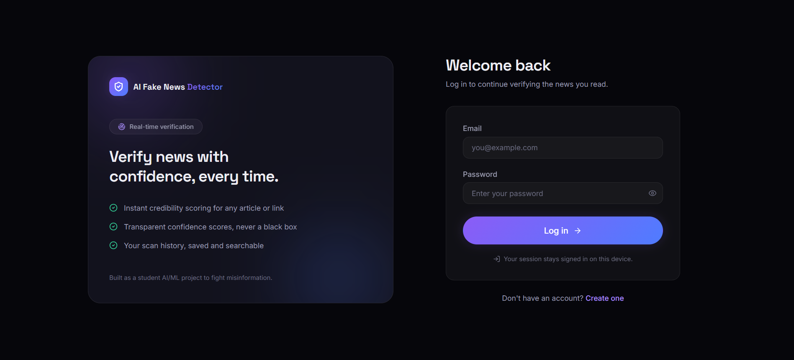
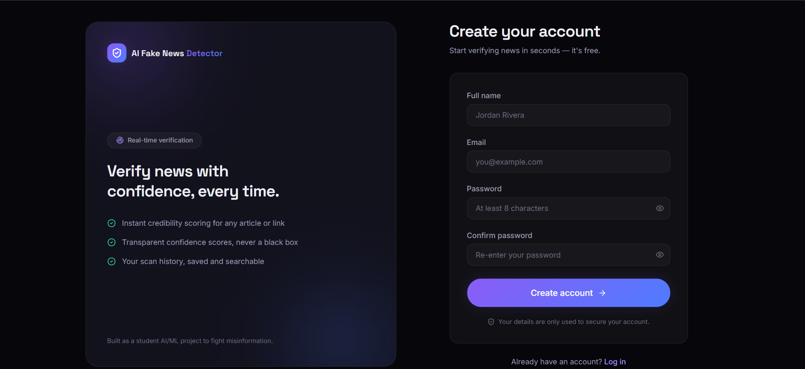
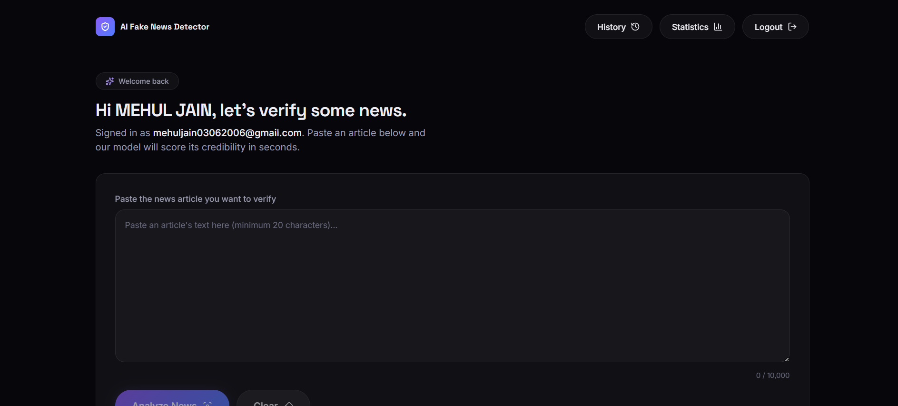
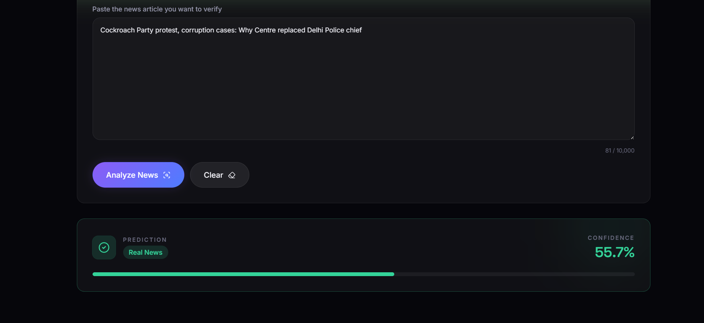
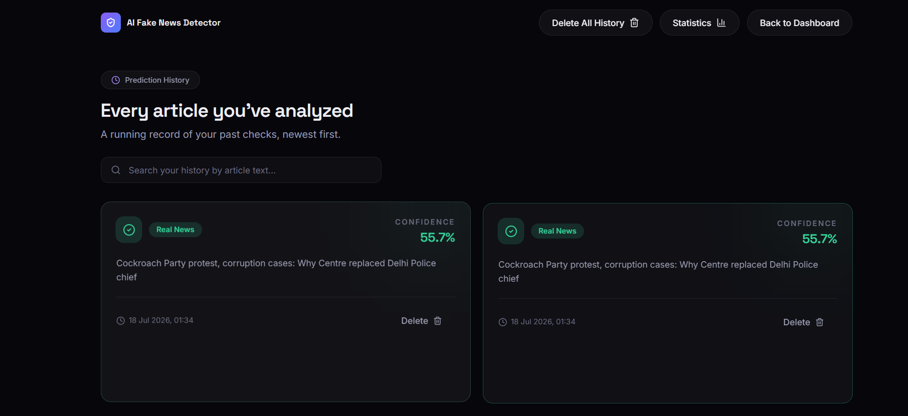
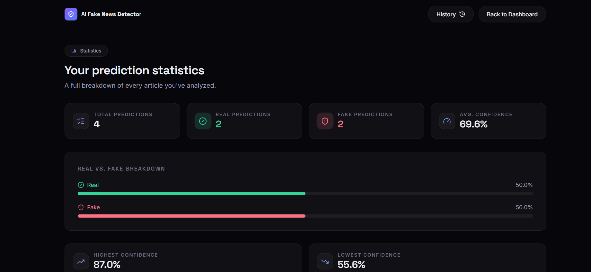

<div align="center">

# 🛡️ TruthLens AI

### AI-Powered Fake News Detection Platform

Detect fake news with Machine Learning using a modern full-stack architecture powered by **React**, **Express**, **FastAPI**, and **MongoDB Atlas**.

<p align="center">

<a href="https://truthlens-ai-app.vercel.app">

</a>


</p>

<p align="center">

A modern full-stack application that leverages Machine Learning to identify whether a news article is <b>Real</b> or <b>Fake</b> while securely storing user history and analytics.

</p>

</div>

---

# 📖 Table of Contents

- [Overview](#-overview)
- [Live Demo](#-live-demo)
- [Key Features](#-key-features)
- [Application Screenshots](#-application-screenshots)
- [Technology Stack](#-technology-stack)
- [System Architecture](#-system-architecture)
- [Project Structure](#-project-structure)
- [Installation](#-installation)
- [Future Improvements](#-future-improvements)
- [Author](#-author)

---

# 🌐 Live Demo

🚀 **Website**

https://truthlens-ai-app.vercel.app

---

# 📌 Overview

TruthLens AI is a full-stack AI-powered fake news detection platform designed to help users verify the authenticity of online news articles.

The application combines modern web technologies with Machine Learning to provide accurate predictions through an intuitive and responsive user interface.

Unlike a simple prediction website, TruthLens AI includes secure authentication, prediction history, user statistics, cloud deployment, and a dedicated AI inference service, making it a complete production-style full-stack application.

---

# 🎯 Problem Statement

Fake news spreads rapidly across social media and online platforms, making it increasingly difficult to distinguish factual information from misinformation.

TruthLens AI addresses this problem by using a trained Machine Learning model capable of classifying news articles as either:

- ✅ Real News
- ❌ Fake News

This helps users quickly verify news before trusting or sharing it.

---

# ✨ Key Features

## 🤖 AI-Powered Prediction

- Detects Fake or Real News
- Machine Learning Classification
- Confidence Score Prediction
- Fast Response Time

---

## 🔐 Authentication

- Secure User Registration
- Login with JWT Authentication
- Protected Routes
- Persistent Sessions

---

## 📊 Dashboard

- Personalized User Dashboard
- Prediction Analytics
- Clean UI
- Responsive Design

---

## 📝 Prediction History

- Stores Previous Predictions
- Search Past Analyses
- Easy Access to Earlier Results

---

## 📈 User Statistics

- Total Predictions
- Fake vs Real Distribution
- Historical Analytics

---

## ⚡ Modern Architecture

- React Frontend
- Express REST API
- FastAPI AI Microservice
- MongoDB Atlas Database

---

# 💡 Why TruthLens AI?

TruthLens AI demonstrates how Artificial Intelligence can be integrated into a modern full-stack application.

The project showcases:

- Full-Stack Web Development
- REST API Design
- Machine Learning Integration
- JWT Authentication
- Cloud Deployment
- Database Design
- Responsive Frontend Development
- Backend Service Communication

It was built as a portfolio project to demonstrate practical software engineering skills along with AI integration.

---


# 📷 Application Screenshots

The following screenshots showcase the major features of **TruthLens AI**.

---

## 🏠 Home Page

The landing page introduces the platform and provides quick access to authentication and fake news detection.

<p align="center">

</p>

---

## 📝 User Registration

Create a secure account using JWT authentication.

<p align="center">

</p>

---

## 📊 Dashboard

The dashboard provides users with an overview of their activity and quick access to predictions.

<p align="center">

</p>

---

## 🤖 AI Prediction

Paste a news article and let the Machine Learning model classify it as **Real** or **Fake** along with a confidence score.

<p align="center">

</p>

---

## 📜 Prediction History

All previous predictions are securely stored for future reference.

<p align="center">

</p>

---

## 📈 Statistics Dashboard

Visual insights into prediction history and usage.

<p align="center">

</p>

---

# 🛠 Technology Stack

## Frontend

| Technology | Purpose |
|------------|---------|
| React | User Interface |
| TypeScript | Type Safety |
| Tailwind CSS | Styling |
| Axios | API Requests |
| React Router | Client-side Routing |

---

## Backend

| Technology | Purpose |
|------------|---------|
| Node.js | Runtime Environment |
| Express.js | REST API |
| JWT | Authentication |
| bcrypt | Password Hashing |
| MongoDB Atlas | Cloud Database |
| Mongoose | ODM |

---

## AI Service

| Technology | Purpose |
|------------|---------|
| Python | ML Backend |
| FastAPI | AI Prediction API |
| Scikit-learn | Machine Learning |
| Pandas | Data Processing |
| NumPy | Numerical Computing |
| Joblib | Model Serialization |

---

## Deployment

| Platform | Purpose |
|----------|---------|
| Vercel | Frontend Hosting |
| Render | Backend Hosting |
| MongoDB Atlas | Database Hosting |

---

# 🏗 System Architecture

```text
                        User
                          │
                          ▼
                 React + TypeScript
                          │
                    Axios Requests
                          │
                          ▼
                 Express.js Backend
                  JWT Authentication
                          │
          ┌───────────────┴───────────────┐
          ▼                               ▼
 MongoDB Atlas                   FastAPI AI Service
(User Data & History)            (ML Prediction API)
                                          │
                                          ▼
                           Scikit-learn Classification Model
```

---

# 🔄 Application Workflow

```text
User enters a news article
          │
          ▼
Frontend sends request
          │
          ▼
Express Backend validates user
          │
          ▼
FastAPI receives article
          │
          ▼
ML Model predicts
          │
          ▼
Prediction returned
          │
          ▼
Backend stores history
          │
          ▼
Frontend displays result
```

---

# 📁 Project Structure

```text
TruthLens-AI/
│
├── frontend/
│   ├── src/
│   ├── public/
│   └── package.json
│
├── backend/
│   ├── controllers/
│   ├── middleware/
│   ├── models/
│   ├── routes/
│   └── server.js
│
├── model/
│   ├── fake_news_model.pkl
│   ├── vectorizer.pkl
│   └── training_notebook.ipynb
│
├── assets/
│   └── screenshots/
│
├── requirements.txt
│
└── README.md
```

---


# 🚀 Installation

Follow these steps to set up TruthLens AI on your local machine.

---

## 1️⃣ Clone the Repository

```bash
git clone https://github.com/MehulJain0306/TruthLens-AI.git
cd TruthLens-AI
```

---

## 2️⃣ Frontend Setup

Navigate to the frontend directory:

```bash
cd frontend
```

Install dependencies:

```bash
npm install
```

Create a `.env` file:

```env
VITE_API_BASE_URL=http://localhost:5000
```

Run the development server:

```bash
npm run dev
```

The frontend will be available at:

```
http://localhost:5173
```

---

## 3️⃣ Backend Setup

Navigate to the backend directory:

```bash
cd backend
```

Install dependencies:

```bash
npm install
```

Create a `.env` file:

```env
PORT=5000

MONGODB_URI=your_mongodb_connection_string

JWT_SECRET=your_secret_key

JWT_EXPIRES_IN=7d

AI_API_URL=http://127.0.0.1:8000

CORS_ORIGIN=http://localhost:5173
```

Start the backend:

```bash
npm run dev
```

The backend will run on:

```
http://localhost:5000
```

---

## 4️⃣ AI Service Setup

Install Python dependencies:

```bash
pip install -r requirements.txt
```

Run the FastAPI server:

```bash
uvicorn app:app --reload
```

The AI API will run on:

```
http://127.0.0.1:8000
```

---

# 🔑 Environment Variables

## Frontend

| Variable | Description |
|----------|-------------|
| `VITE_API_BASE_URL` | Backend API URL |

---

## Backend

| Variable | Description |
|----------|-------------|
| `PORT` | Backend Port |
| `MONGODB_URI` | MongoDB Atlas Connection String |
| `JWT_SECRET` | JWT Secret Key |
| `JWT_EXPIRES_IN` | JWT Expiry Time |
| `AI_API_URL` | FastAPI Service URL |
| `CORS_ORIGIN` | Allowed Frontend URL |

---

# ☁ Deployment

TruthLens AI is deployed using modern cloud services.

| Component | Platform |
|-----------|----------|
| Frontend | Vercel |
| Backend | Render |
| AI Service | Render |
| Database | MongoDB Atlas |

---

## 🌐 Live Website

**Frontend**

https://truthlens-ai-app.vercel.app

---

## Deployment Flow

```text
GitHub
   │
   ├──────────────► Vercel
   │                  │
   │                  ▼
   │          React Frontend
   │
   └──────────────► Render
                      │
          ┌───────────┴───────────┐
          ▼                       ▼
   Express Backend         FastAPI AI
                      │
                      ▼
                Machine Learning
```

---

# 🧪 Example Prediction

### Input

```
Scientists discover a new renewable energy source capable of reducing carbon emissions by 80%.
```

### Output

```
Prediction : REAL NEWS

Confidence : 96.41%
```

---

# 🔒 Security Features

- JWT Authentication
- Password Hashing using bcrypt
- Protected API Routes
- Input Validation
- Secure Environment Variables
- MongoDB Cloud Security
- RESTful API Architecture

---


# 🎯 Future Improvements

Although TruthLens AI is fully functional, there are several exciting enhancements planned for future versions:

- 🧠 Replace the current ML model with **BERT** or **DistilBERT** for higher prediction accuracy.
- 🌍 Add **multi-language fake news detection**.
- 🔎 Integrate trusted **fact-checking APIs** for real-time verification.
- 📱 Develop a dedicated **mobile application**.
- 🌐 Build a **browser extension** to detect fake news while browsing.
- 📊 Improve analytics with interactive charts and insights.
- 🤖 Add AI-generated explanations for each prediction using Explainable AI (XAI).

---

# 📚 What I Learned

Building TruthLens AI provided hands-on experience with:

- Building scalable full-stack applications
- Designing secure REST APIs
- JWT Authentication & Authorization
- React + TypeScript development
- Backend development with Express.js
- Machine Learning model deployment using FastAPI
- MongoDB Atlas integration
- Cloud deployment using Vercel and Render
- Managing environment variables securely
- Connecting multiple services in a production-like architecture

---

# 🤝 Contributing

Contributions are welcome!

If you'd like to improve TruthLens AI:

1. Fork the repository.
2. Create a new feature branch.
3. Commit your changes.
4. Push your branch.
5. Open a Pull Request.

Suggestions, bug reports, and feature requests are always appreciated.

---

# 📄 License

This project is licensed under the **MIT License**.

See the `LICENSE` file for more information.

---

# 👨‍💻 Author

<div align="center">

## Mehul Jain

B.Tech (Artificial Intelligence & Machine Learning)

Building full-stack web applications powered by AI and Machine Learning.

<p>

<a href="https://github.com/MehulJain0306">

</a>

<a href="https://www.linkedin.com/in/mehul-jain-687125287">

</a>

</p>

</div>

---

# ⭐ Support

If you found this project helpful or interesting, consider giving it a **⭐ Star** on GitHub.

It helps others discover the project and motivates future improvements.

---

<div align="center">

## Thank You for Visiting!

If you have any questions, suggestions, or feedback, feel free to connect with me on GitHub or LinkedIn.

⭐ **Happy Coding!**

</div>